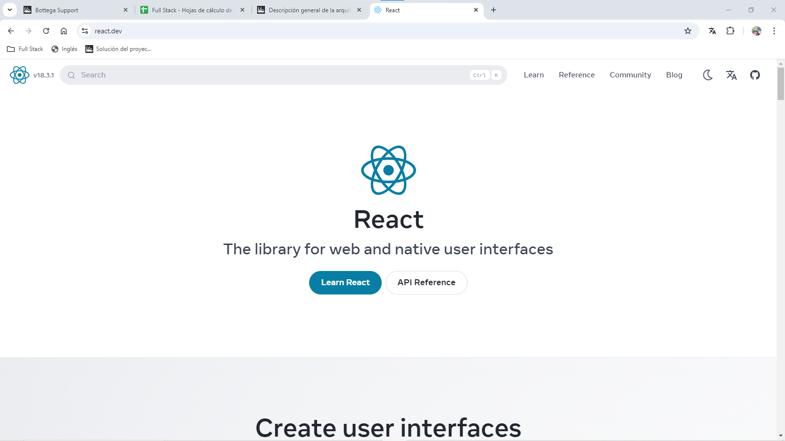

# [Descripción general de la arquitectura de reacción🔗][def]
Uno de los primeros pasos es comprender la arquitectura general de React.
+ Ayuda a comprender: 
  + Cual es el objetivo final
  + cómo React le permite construir estas poderosas interfaces

Pagina inicio de react: [Reactjs.org](https://react.dev/)  

# [🔗]()

# [🔗]()

# [🔗]()

# [🔗]()

# [🔗]()

## Coding Exercise

### Resultado Coding Exercise

# <!-- Extract to link definition -->
[def]: https://basque.devcamp.com/pt-full-stack-development-javascript-python-react/guide/react-architecture-overview